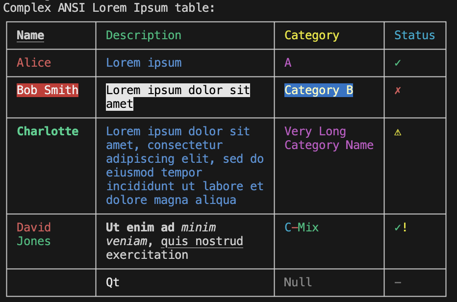
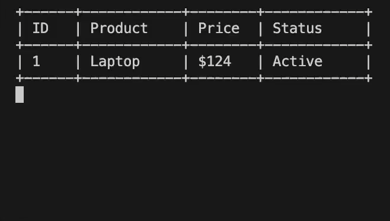

# ASCII ANSI Table

A fast, comprehensive Rust library for rendering ASCII and Unicode tables with ANSI color support, text wrapping, and advanced formatting capabilities.

> ⚠️ **Early Development Notice**  
> This crate is in early alpha development (v0.1.0-alpha.1). While functional, the API may change between versions.  
> **Not recommended for production use yet.** Please report issues and provide feedback!



*Example showing ANSI color support, text wrapping, multiple border styles, and Unicode symbols*

## Features

### Core Table Rendering
- **ASCII & Unicode Support**: Render tables with ASCII characters or beautiful Unicode box drawing characters
- **ANSI Color Preservation**: Full support for ANSI escape sequences and color codes in cell content
- **Multiple Border Styles**: Built-in border styles including `honeywell`, `norc`, `ramac`, and `void`
- **Custom Border Configuration**: Define your own border characters for complete customization

### Text Processing & Layout
- **Intelligent Text Wrapping**: Word-based and character-based text wrapping with configurable width
- **Cell Alignment**: Horizontal alignment (left, center, right) and vertical alignment (top, middle, bottom)
- **Padding Control**: Configurable left and right padding for each column
- **Text Truncation**: Optional text truncation with customizable limits
- **Unicode Width Calculation**: Accurate display width calculation for Unicode characters

### Advanced Features
- **Spanning Cells**: Support for cells that span multiple rows and columns
- **Column Configuration**: Individual column settings for width, alignment, padding, and wrapping
- **Header Support**: Dedicated header configuration with different styling
- **Streaming Support**: Memory-efficient streaming for large datasets
- **Single-line Mode**: Compact table rendering without horizontal separators

### Cross-Platform Compatibility
- **CLI Interface**: Command-line tool for table generation from JSON and CSV
- **WASM Bindings**: WebAssembly support for browser and Node.js environments
- **Serde Integration**: Serialize/deserialize table configurations
- **Performance Optimized**: Efficient rendering with release-mode optimizations

## Installation

Add to your `Cargo.toml`:

```toml
[dependencies]
ascii_ansi_table = "0.1.0"
```

## Quick Start

```rust
use ascii_ansi_table::{table, TableUserConfig, ColumnUserConfig, BorderUserConfig};

// Basic table
let data = vec![
    vec!["Name".to_string(), "Age".to_string(), "City".to_string()],
    vec!["John".to_string(), "30".to_string(), "New York".to_string()],
    vec!["Jane".to_string(), "25".to_string(), "London".to_string()],
];

let result = table(&data, None).unwrap();
println!("{}", result);
```

Output:
```
┌──────┬─────┬──────────┐
│ Name │ Age │ City     │
├──────┼─────┼──────────┤
│ John │ 30  │ New York │
│ Jane │ 25  │ London   │
└──────┴─────┴──────────┘
```


## Advanced Usage

### Custom Configuration

```rust
use ascii_ansi_table::{table, TableUserConfig, ColumnUserConfig, BorderUserConfig};

let config = TableUserConfig {
    border: Some(BorderUserConfig {
        top_left: Some("+".to_string()),
        top_right: Some("+".to_string()),
        bottom_left: Some("+".to_string()),
        bottom_right: Some("+".to_string()),
        top_body: Some("-".to_string()),
        bottom_body: Some("-".to_string()),
        body_left: Some("|".to_string()),
        body_right: Some("|".to_string()),
        body_join: Some("|".to_string()),
        // ... other border settings
    }),
    columns: Some(vec![
        ColumnUserConfig {
            width: Some(10),
            wrap_word: Some(true),
            alignment: Some(Alignment::Center),
            padding_left: Some(2),
            padding_right: Some(2),
            // ... other column settings
        }
    ]),
    // ... other table settings
};

let result = table(&data, Some(&config)).unwrap();
```

### Text Wrapping

```rust
let data = vec![
    vec!["This is a very long text that will be wrapped".to_string()],
];

let config = TableUserConfig {
    columns: Some(vec![
        ColumnUserConfig {
            width: Some(20),
            wrap_word: Some(true),
            // ... other settings
        }
    ]),
    // ... other settings
};

let result = table(&data, Some(&config)).unwrap();
```

### ANSI Color Support

```rust
let data = vec![
    vec![
        "\u{1b}[31mRed Text\u{1b}[0m".to_string(),
        "\u{1b}[32mGreen Text\u{1b}[0m".to_string(),
    ],
];

let result = table(&data, None).unwrap();
// Colors are preserved in the output
```

### Spanning Cells

```rust
use ascii_ansi_table::{table, TableUserConfig, SpanningCellConfig};

let config = TableUserConfig {
    spanning_cells: Some(vec![
        SpanningCellConfig {
            col: 0,
            row: 0,
            col_span: Some(2),
            row_span: Some(1),
            // ... other spanning settings
        }
    ]),
    // ... other settings
};
```

## Border Styles

### Built-in Styles

```rust
use ascii_ansi_table::get_border_characters;

// Unicode box drawing (default)
let honeywell = get_border_characters("honeywell").unwrap();

// ASCII characters
let ramac = get_border_characters("ramac").unwrap();

// No borders
let void = get_border_characters("void").unwrap();
```

### Available Border Styles

| Style | Description | Example |
|-------|-------------|---------|
| `honeywell` | Unicode box drawing characters | `┌─┬─┐` |
| `norc` | Double-line Unicode characters | `╔═╦═╗` |
| `ramac` | ASCII characters | `+-+-+` |
| `void` | No borders, space-separated | ` ` |

## CLI Usage

Install the CLI tool:
```bash
cargo install ascii_ansi_table --features cli
```

Use from command line:
```bash
# From JSON
echo '[["Name", "Age"], ["John", "30"]]' | ascii_ansi_table

# From CSV
echo "Name,Age\nJohn,30" | ascii_ansi_table --format csv

# Custom border style
echo '[["A", "B"]]' | ascii_ansi_table --border ramac

# Interactive streaming demo
ascii_ansi_table stream-demo --rows 10 --delay 1000 --colors --border honeywell
```

### Streaming Demo

Experience real-time table rendering with the interactive streaming demo:



*Real-time table streaming with ANSI colors and progressive row addition*

```bash
# Basic streaming demo
ascii_ansi_table stream-demo

# Customized streaming with colors and border
ascii_ansi_table stream-demo --rows 15 --delay 800 --colors --border ramac

# Fast streaming with custom column widths
ascii_ansi_table stream-demo --rows 20 --delay 200 --widths 4,12,8,15
```

**Streaming Demo Features:**
- **Real-time updates**: Tables update in-place with smooth animations
- **Auto-calculated widths**: Optimal column widths calculated from data
- **ANSI color support**: Rich colors with status indicators (✓, ✗, ⚠, 🚚, 📦)
- **Multiple border styles**: Choose from honeywell, norc, ramac, or void
- **Configurable timing**: Adjust delay between rows (default: 1 second)
- **Custom widths**: Override auto-calculated widths if needed
- **Progress tracking**: Visual feedback during streaming process

```

## WASM Support

For web applications:

```toml
[dependencies]
ascii_ansi_table = { version = "0.1.0", features = ["wasm"] }
```

```javascript
import { table } from 'ascii_ansi_table';

const data = [
    ["Name", "Age"],
    ["John", "30"]
];

const result = table(data);
console.log(result);
```

## Performance

The library is optimized for performance:

- **Streaming Support**: Handle large datasets without memory issues
- **Efficient Text Processing**: Optimized wrapping and alignment algorithms
- **Minimal Allocations**: Careful memory management for large tables
- **Release Mode**: Significant performance improvements with `--release` flag

### Benchmarks

```bash
# Run performance benchmarks
cargo bench

# Run performance tests
cargo test --release performance
```

## API Reference

### Main Functions

- `table(data: &[Row], config: Option<&TableUserConfig>) -> TableResult<String>`
- `get_border_characters(style: &str) -> TableResult<BorderConfig>`

### Configuration Types

- `TableUserConfig`: Main table configuration
- `ColumnUserConfig`: Per-column settings
- `BorderUserConfig`: Border style configuration
- `SpanningCellConfig`: Spanning cell configuration

### Utility Functions

- `wrap_text(text: &str, width: usize, word_wrap: bool) -> Vec<String>`
- `calculate_cell_height(text: &str, width: usize, word_wrap: bool) -> usize`

## Examples

Check the `examples/` directory for comprehensive examples:

- Basic table rendering
- Custom styling and borders
- Text wrapping and alignment
- ANSI color support
- Spanning cells
- Large dataset handling
- CLI usage

## Contributing

Contributions are welcome! Please read our contributing guidelines and submit pull requests.

## Migration Notice

This project has been migrated from GitLab to GitHub to support our open source initiative. Milestones of the development history and all features have been preserved. 

## License

This project is licensed under the MIT License - see the LICENSE file for details.

## Acknowledgments

- Built with Rust's powerful type system and memory safety
- Uses `textwrap` for intelligent text wrapping
- Implements Unicode standard for proper character width calculation
- Inspired by [gajus/table](https://github.com/gajus/table) - A JavaScript table formatting library
- Original concept adapted and significantly extended for Rust with new features like streaming, WASM support, and enhanced ANSI handling